# Liminal HQ Shared Infrastructure

This repository is the shared home for Liminal HQ CI infrastructure, container image pipelines, and reusable automation.

## Scope

- Shared GitHub Actions workflows for CI image publication
- Shared Docker images for Tauri desktop and mobile workloads
- Runbooks for publish, rollback, and digest pinning

## Shared Images

- `ghcr.io/liminal-hq/tauri-ci-desktop`
- `ghcr.io/liminal-hq/tauri-ci-mobile`
- `ghcr.io/liminal-hq/tauri-dev-desktop`
- `ghcr.io/liminal-hq/tauri-dev-mobile`

## Image Families

- CI images are for GitHub Actions and other automated pipelines that want a lean, root-friendly toolchain baseline.
- Dev images are for devcontainers and interactive local work, with a non-root user-home layout for Cargo, Rustup, pnpm, and Android tooling.

## Layout Scheme

- Docker targets:
  - `ci-desktop`
  - `ci-mobile`
  - `dev-desktop`
  - `dev-mobile`
- Shared image layout reference: [`docs/reference/shared-image-layout.md`](https://github.com/liminal-hq/.github/blob/main/docs/reference/shared-image-layout.md)

## Repositories in Scope

- [`liminal-hq/tauri-plugins-workspace`](https://github.com/liminal-hq/tauri-plugins-workspace)
- [`liminal-hq/threshold`](https://github.com/liminal-hq/threshold)
- [`ScottMorris/liminal-notes`](https://github.com/ScottMorris/liminal-notes)

## Onboarding Links

- Image publish workflow: [`.github/workflows/shared-tauri-ci-images.yml`](https://github.com/liminal-hq/.github/blob/main/.github/workflows/shared-tauri-ci-images.yml)
- Shared Dockerfile: [`docker/ci/Dockerfile`](https://github.com/liminal-hq/.github/blob/main/docker/ci/Dockerfile)
- Shared image layout reference: [`docs/reference/shared-image-layout.md`](https://github.com/liminal-hq/.github/blob/main/docs/reference/shared-image-layout.md)
- Publish and rollback runbook: [`docs/runbooks/image-publish-and-rollback.md`](https://github.com/liminal-hq/.github/blob/main/docs/runbooks/image-publish-and-rollback.md)
